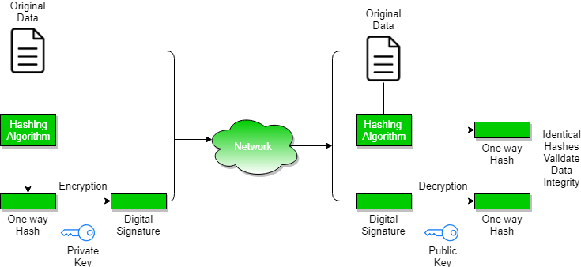

Authorization and Authentication
    Authentication verifies the identity of a user or service, and authorization determines their access rights.
Authentication-Authentication is any process by which a system verifies the identity of a user who wishes to access it. 

Non- repudiation– Non-repudiation means to ensure that a transferred message has been sent and received by the parties claiming to have sent and received the message. Non-repudiation is a way to guarantee that the sender of a message cannot later deny having sent the message and that the recipient cannot deny having received the message. 

Integrity– to ensure that the message was not altered during the transmission. 

Message digest -The representation of text in the form of a single string of digits, created using a formula called a one way hash function. Encrypting a message digest with a private key creates a digital signature which is an electronic means of authentication.. 

    refer https://www.geeksforgeeks.org/digital-signatures-certificates/
    